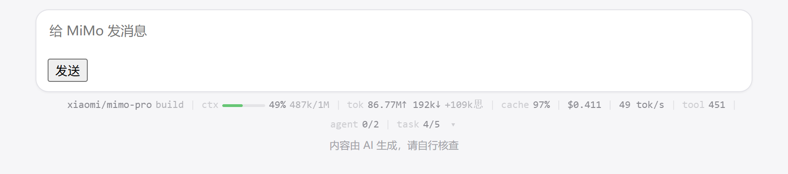
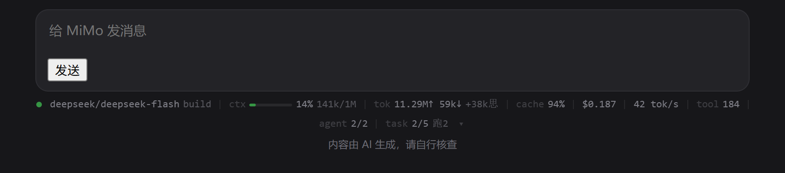
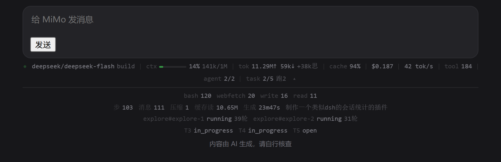

# MiMo 会话统计条

> 非官方第三方工具,与 Xiaomi 无关联。不修改 MiMo Desktop 的任何文件。

给 MiMo Desktop 加一条常驻在输入框(composer)下方的实时统计条:上下文占用、token 用量、缓存命中、花费、生成速度、工具调用、子代理、任务进度。

数据全部来自引擎自己的落库记录,不是估算;显示方式沿用应用的 CSS 变量,明暗主题自动跟随。



上图是真实会话的数据(不是示意):26% 上下文、25.22M 输入 token、97% 缓存命中、$0.299、102 tok/s、249 次工具调用。

深色主题会自动跟随应用的 CSS 变量:



展开后可以看到工具分布、步数/消息数、每个子代理的状态、任务清单:



## 安装到新电脑

前提两样:

1. **MiMo Desktop** 已经装好(统计条是给它加的)。
2. **Node 22.5 以上**。没有的话先装:<https://nodejs.org> 的 LTS,或 `winget install OpenJS.NodeJS.LTS`。

步骤:

1. 把 `mimo-statusbar-install.zip` 拷到目标电脑,解压(得到一个 `mimo-statusbar` 文件夹)。
2. 双击 `mimo-statusbar\bin\install.cmd`。
   - 脚本会检查 Node 和 MiMo Desktop 是否就绪;
   - 把自己复制到 `%LOCALAPPDATA%\Programs\mimo-statusbar`;
   - 在桌面和开始菜单创建「MiMo 统计条」快捷方式。
3. **退出正在运行的 MiMo**(如果有),然后双击桌面「MiMo 统计条」。
4. 统计条出现在输入框下方 —— 完成。

之后打开 MiMo 一律用这个快捷方式。开始菜单的原版图标不带调试端口,用它打开统计条不会出现。

安装脚本的可选参数:

| 参数 | 作用 |
|---|---|
| `--dir <路径>` | 装到别处,默认 `%LOCALAPPDATA%\Programs\mimo-statusbar` |
| `--no-shortcut` | 不创建快捷方式 |
| `--run` | 装完立刻后台启动统计条 |

卸载:双击安装目录里的 `bin\uninstall.cmd`(会停掉注入器、删掉快捷方式;加 `--purge` 连目录一起删)。

如果 MiMo Desktop 不在默认位置,先设环境变量 `MIMO_STATSBAR_APP` 指向 `Xiaomi MiMo.exe`,再运行安装。

## 日常使用

桌面上已经放了快捷方式 **「MiMo 统计条」** —— 用它打开 MiMo 即可,统计条会在后台自动挂上,**没有常驻的黑窗口**。

| 操作 | 怎么做 |
|---|---|
| 开 | 双击桌面「MiMo 统计条」(= `bin\start-hidden.cmd`) |
| 关 | 双击 `bin\stop.cmd`(统计条约 10 秒内自行从界面上消失) |
| 看运行记录 | `logs\statusbar.log` |

需要注意的只有一件事:**别再用开始菜单/任务栏的原版图标打开 MiMo**。原版启动不会带上调试端口,统计条也就不会出现。如果你已经那样打开了,退出 MiMo,再双击桌面快捷方式。

第一次配置时(如果当时 MiMo 正在跑),需要交互式地重启一次应用 —— 那一次用 `bin\launch.cmd`,它会问你是否关闭并重启,因为必须重启:见下面「为什么必须重启」。之后就再也不需要它了。

同一时刻只允许一个注入器(它们会互相覆盖同一个 DOM 节点),重复启动会被拒绝;确认要接管时用 `bin\launch.cmd --force`。

要求:Node 22.5 以上(用到内置的 `node:sqlite` 与 `WebSocket`,所以没有任何第三方依赖)。

## 为什么必须重启

MiMo Desktop 带单实例锁(`out/main/index.mjs` 的 `requestSingleInstanceLock`)。已经在运行时,你再用带参数的方式启动它,新进程会把参数丢掉、只把旧窗口拉到前台 —— 调试端口永远不会打开。所以启动器会先关掉旧进程。

启动器只是给应用加了一个 `--remote-debugging-port=9222` 参数,**没有改动 MiMo 的任何文件**。安装目录、`app.asar`、配置文件都保持原样;卸载就是删掉这个文件夹。

## 原理

```
桌面快捷方式 / bin/start-hidden.cmd
   └─ src/start-hidden.mjs   以 windowsHide 方式分离启动,不产生可见窗口
        └─ src/launch.mjs --hidden
             ├─ 端口已开 → 只挂注入器,不重启应用
             ├─ 端口没开且 MiMo 在跑 → 写日志后退出(后台模式不会擅自杀你的应用)
             └─ MiMo 没在跑 → 带 --remote-debugging-port 启动它
                  └─ src/inject.mjs  轮询取数 → 通过 CDP 推给页面
                       ├─ src/stats.js       只读查询 mimocode.db(引擎的会话库)
                       ├─ src/resolve.mjs    从 composer-input.json 读当前会话
                       ├─ src/cdp.js         极简 CDP 客户端(fetch + Node 内置 WebSocket)
                       └─ src/page/bar.js    在渲染进程里渲染统计条

bin/stop.cmd → src/stop.mjs  按锁文件里的 pid 结束注入器
```

统计数字来自 `~/.local/share/mimocode/mimocode.db`。引擎每推进一步都会落一条记录,用量和花费都由它算好:

```json
{"type":"step-finish","tokens":{"total":43562,"input":42530,"output":271,
 "reasoning":761,"cache":{"write":0,"read":43520}},"cost":0.00032646}
```

数据库以只读方式打开,不建 `-wal`、不碰写锁,和正在跑的 agent 互不干扰。

**当前会话**由两件事共同决定,缺一不可:

1. **composer 的变体。** 渲染层会挂两种:`dock`(打开着一条对话,带 `composer-dock` id)和 `home`(新建任务页,带 `composer-home` 类、没有 id)。只有 dock 才代表「有一条对话打开」。
2. **`%APPDATA%\Xiaomi MiMo\composer-input.json` 的 `currentKey`**,桌面的「当前对话」记录。

为什么两个都要:点「新建任务」回到空白页时,桌面**不会**清掉 `currentKey`,它还指向上一条对话 —— 只看它就等于把上一条的数字挂在新对话上。所以判定顺序是:不是 dock → 显示 `新对话 · 还没有数据`;是 dock → 按 `currentKey` 取该会话。

统计条带自愈:注入器每轮都会带上一个心跳期限,连续十轮收不到更新(默认 10 秒)它就自行退场。所以在 Windows 上被强杀、进程崩了、控制台被关掉,留下的都不会是一条数字冻结的假条。

注入器还会自我升级:页面上的统计条版本比脚本旧时,直接就地替换(日志里会写 `页面上的统计条是 v1,升级到 v2`),不需要重启应用。

## 显示什么

| 指标 | 来源 |
|---|---|
| 模型 / 模式 | 最近一条主代理消息的 `modelID`/`providerID`/`mode` |
| 上下文占用(条+百分比+用量) | 最近一条主代理消息的 `tokens.total` ÷ 上下文窗口 |
| token(输入↑/输出↓/思考) | 所有 `step-finish` 的 `tokens` 分桶求和 |
| 缓存命中率 | `cacheRead ÷ (input + cacheRead + cacheWrite)` |
| 花费 | `step-finish.cost` 求和(**引擎给的值**,不是我自己套价格表)—— 算法见下节 |
| 生成速度 | 输出 token ÷ 各消息实际生成耗时之和(不含等待) |
| 工具调用数 / 分布 | `part` 里 `type=tool` 的计数与分组 |
| 子代理 | `actor_registry` 的实时状态与轮数 |
| 任务进度 | `task` 表按状态计数 |
| 步数/消息数/压缩次数/会话标题 | 明细面板里,点击 `▾` 展开 |

## 费用怎么算出来的

`$` 那一栏是**引擎自己算好写进库的**,统计条只做求和 —— 不碰价格表、不做乘法。

引擎在每个模型步结束时调一次 `getUsage()`,把结果写进 `part.data.cost`:

```
input × price.input            ← input 已减掉缓存部分
+ output × price.output        ← output 已减掉思考部分
+ reasoning × price.output     ← 思考按输出单价计
+ cache.read × price.cache.read
+ cache.write × price.cache.write
```

单价都是**美元 / 百万 token**,用 `Decimal` 累加后再转 number。

三条值得注意的行为:

- **模型没有价格 → 记 0。** 源码里是 `costInfo?.input ?? 0`,没有价目表的模型(比如部分 `mimo-*` 通道)全部按 0 计。所以 token 一直在涨、`$` 却不动,是正常的,不是 bug。
- **`input` 桶是「未走缓存」的部分。** 引擎先算 `inputTokens - cacheRead - cacheWrite`,命中的缓存 token 单独按 `cache.read` 计,不会重复计费。
- **超过 20 万 token 可能换价档。** `input + cache.read > 200000` 且模型配置了 `experimentalOver200K` 时,整单改用那一档的价格。

消息上的 `cost` 是逐步累加的(`message.cost += usage.cost`),所以步内求和与消息级求和完全一致 —— 实测两者差为 0。

**这是估算,不是账单。** 价目表来自本机的模型目录与引擎配置;实际扣费以平台为准。

### 价格是谁定的

价目表来自 **models.dev 社区目录**:引擎联网拉取并缓存在 `~/.cache/mimocode/models.json`,桌面另存一份在 `%APPDATA%\Xiaomi MiMo\models-with-claude.json`。两份数据同源,按 `provider/model` 取价。

自定义(BYOK)API 模型也是同一个匹配规则 —— 拼出来的 id 在目录里有,就有价;没有,`cost()` 归一化时全填 0,统计条就显示 `$0`。**桌面的「自定义模型」界面只有名字 / API Key / 上下文上限,没有价格输入框**,所以要改价只能动配置文件:

```jsonc
// ~/.config/mimocode/mimocode.json
"provider": {
  "myproxy": {
    "npm": "@ai-sdk/openai-compatible",
    "options": { "baseURL": "https://…/v1", "apiKey": "…" },
    "models": {
      "my-model": {
        "name": "my-model",
        "cost": {                        // 单位:美元 / 百万 token
          "input": 0.15,                 // 未走缓存的输入
          "output": 0.6,                 // 输出(思考按 output 单价计,目录里的 reasoning 字段会被忽略)
          "cache_read": 0.003,           // 缓存命中读取
          "cache_write": 0               // 缓存写入,可省略
        },
        "context_over_200k": {           // 可选:超过 20 万 token 时改用这一档
          "input": 0.3, "output": 1.2, "cache_read": 0.006, "cache_write": 0
        }
      }
    }
  }
}
```

改完配置要重启 MiMo 才生效(桌面设置里的提示也是 `Restart the app to enable custom models`)。

复算示例(拿本机目录对 `deepseek/deepseek-flash` 的价 `0.15 / 0.6 / 0.003` 验证,精确到末位):

| 步 | input | output | reasoning | cache.read | 库里的 cost | 复算 |
|---|---|---|---|---|---|---|
| 1 | 42530 | 271 | 761 | 0 | 0.0069987 | 0.0069987 |
| 2 | 298 | 198 | 54 | 43520 | 0.00032646 | 0.00032646 |

上下文条在 75% 变琥珀、90% 变红;有子代理在跑或最近 4 秒内有动作时,左侧圆点会呼吸。

## 配置

`config.json`:

| 键 | 默认 | 说明 |
|---|---|---|
| `port` | `9222` | 调试端口,和启动器读的是同一份 |
| `refreshMs` | `1000` | 空闲时的轮询间隔 |
| `busyRefreshMs` | `250` | 有子代理在跑时的轮询间隔 |
| `contextWindowOverride` | `null` | 手工指定上下文窗口。不填就按 `provider/model` 去本机模型目录查,查不到就只显示 token 不显示百分比 |
| `pinnedSessionId` | `null` | 钉住某个会话(优先级最高,会盖过当前对话) |
| `composerInputPath` | `null` | 桌面记录「当前对话」的那个文件。`null` = 用 `%APPDATA%\Xiaomi MiMo\composer-input.json` |
| `log` | `true` | 打印轮询日志 |

对应环境变量:`MIMO_STATSBAR_CONFIG`(换配置文件)、`MIMO_STATSBAR_APP`(换可执行文件路径)。

## 已知限制

- **必须用桌面快捷方式(或启动器)打开 MiMo。** 从开始菜单/任务栏正常启动的 MiMo 没有调试端口,统计条不会出现。这是「不改应用文件」的代价。快捷方式在后台起注入器,不占窗口;调试端口已经开着时它只挂注入器,不会重启应用。
- **当前会话跟着界面走。** 判定依据是 composer 变体(是否打开着一条对话)+ 桌面 `composer-input.json` 的 `currentKey`。在新建任务页会显示 `新对话 · 还没有数据`,不会拿上一条对话的数字充数。刚新建、引擎还没落库的对话,`currentKey` 是临时 `c…` key,同样按新对话处理。
- **上下文窗口取决于本机模型目录。** 目录里没有对应条目就只能显示 token。用 `contextWindowOverride` 兜底。
- **花了多少 token 是准确的,钱是引擎估的。** 数值直接取自引擎的 `cost` 字段。

## 卸载

双击安装目录里的 `bin\uninstall.cmd`(默认装在 `%LOCALAPPDATA%\Programs\mimo-statusbar`)。它会停掉后台注入器、删掉桌面和开始菜单的快捷方式;想连安装目录一起删掉,用 `bin\uninstall.cmd --purge`。

手动方式:`bin\stop.cmd` 停注入器 → 删快捷方式 → 删安装目录。

MiMo 本身没有被改过,不需要恢复任何东西。之后正常启动 MiMo 即可。

## 故障排查

| 现象 | 原因 / 做法 |
|---|---|
| **应用更新后统计条不见了**(最常见) | 官方更新会用普通方式重启 MiMo,调试端口丢了,注入器只能空等。**退出 MiMo,再双击桌面「MiMo 统计条」**。启动器会自动接管空等的旧注入器,不需要先跑 stop |
| 统计条没出现 | MiMo 不是用桌面快捷方式打开的。退出 MiMo,再双击「MiMo 统计条」 |
| 快捷方式闪一下就没了,还是没有统计条 | 见上一条;窗口里会写清「MiMo 正在运行,但调试端口没开」 |
| 日志里反复出现「端口 9222 上还没有调试接口(已等 Ns)」 | 同上:应用不是用启动器起的,或更新后重启了 |
| 启动器说关了 MiMo 但端口仍不通 | 有残留进程,在任务管理器里手动结束 `Xiaomi MiMo.exe` 后重试 |
| 统计条显示了但数字不随对话切换 | 看 `logs\statusbar.log` 里有没有「当前会话 -> …」;没有就是注入器没在轮询,`bin\stop.cmd` 后重新启动 |
| 重复启动被拒(PID xxx) | 已有注入器在跑**且端口是通的**。确认要接管时用 `bin\launch.cmd --force`,或先 `bin\stop.cmd` |
| `需要 Node >= 22.5` | 升级 Node,或把 `node` 换成 22.5+ 的版本 |

诊断脚本:`node test\inspect-page.mjs` 看挂载与选择器,`node test\inspect-live.mjs` 核对会话与数字。

## 开发

| 命令 | 说明 |
|---|---|
| `node test/resolve.mjs` | 会话识别:currentKey 优先于页面刮取和数据库启发,含坏 JSON / 临时 key 的边界 |
| `node test/stats.mjs` | 数据层:自建 SQLite fixture,覆盖空会话、只有子代理、压缩等边界 |
| `node test/render.mjs` | 渲染层:headless Edge 里挂载并断言 DOM,输出三张预览图 |
| `node test/e2e.mjs` | 全链路:真实注入器 + 真实 `mimocode.db`,并**改写 currentKey 验证切换对话后数字跟着变** |
| `node test/inspect-live.mjs` | 对正在跑的实例:核对统计条显示的会话/数字是否与桌面 currentKey 及数据库一致 |
| `node test/inspect-page.mjs` | 对正在跑的实例:看 composer 选择器、统计条挂载状态、页面自己刮到的会话 id |
| `cmd /c bin\launch.cmd --dry-run` | 只看启动器会做什么,不动应用(含锁与端口状态) |

`e2e.mjs` 用一个仿 composer 的无头页面当替身,所以它验证的是「除应用是否开启调试端口之外」的每一环。

## 关于 DLL 注入

最初的想法是写个 DLL 注入进去 hook UI。这条路对 Electron 不通:渲染进程是 Chromium,要拿到 DOM 得从原生侧调 V8/Blink 内部 API,应用一升级就崩;而且「把 DLL 丢进目录里自注入」这个行为模式本身就与恶意软件一致,会被杀软拦。

另外两条更接近的路也实测排除了:

- `NODE_OPTIONS=--require=hook.cjs` —— 虽然该版本的 Electron fuse `EnableNodeOptionsEnvironmentVariable` 是开着的,但 Electron 在正常主进程模式下会把 `--require` 剥掉(同一个变量在 `ELECTRON_RUN_AS_NODE` 模式下却生效),实测主进程里没有执行到。
- 改 `app.asar` 里的 preload —— fuse `EnableEmbeddedAsarIntegrityValidation` 是关的,技术上可行,但会动应用文件、每次升级被覆盖,不划算。

最后选的是外部 CDP 注入:完全不动 MiMo,可随时撤离。

## License

MIT
